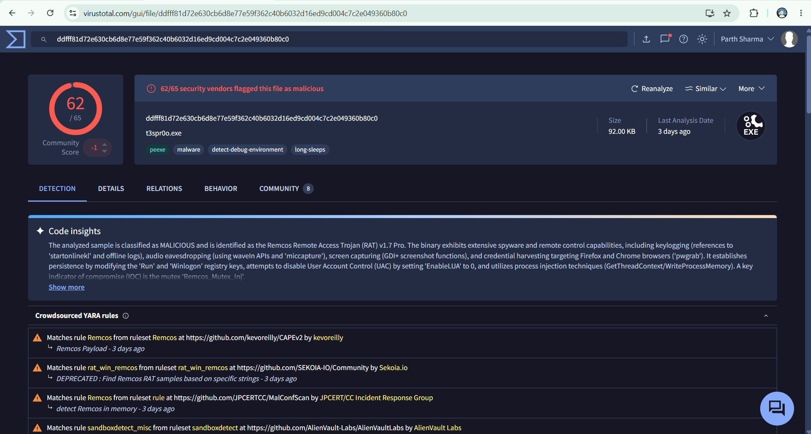
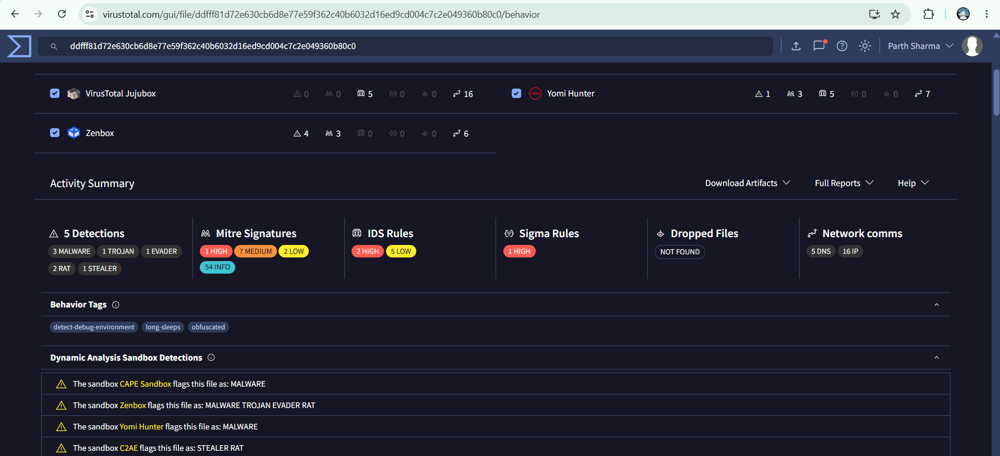

# RemcosRAT Malware Analysis 

Complete static analysis of RemcosRAT sample 
from MalwareBazaar.

## Workflow
1. Sample downloaded from MalwareBazaar
2. Hash extracted using Python
3. Strings analyzed using Linux strings command
4. VirusTotal multi-engine scan
5. MITRE ATT&CK mapping

## Sample Details
- SHA256: ddfff81d72e630cb6d8e77e59f362c40b6032d16ed9cd004c7c2e049360b80c0
- MD5: b82ad2590f7b479aa1d2699401ce8b5e
- Size: 94,208 bytes
- Family: RemcosRAT
- Type: Remote Access Trojan

## Findings

### Capabilities
| Capability | Evidence |
|------------|----------|
| Keylogger | deletekeylog string |
| Clipboard Theft | getclipboard, setclipboard |
| Screen Capture | screenshotdata |
| UAC Bypass | EnableLUA registry key |
| C2 Communication | "Connected to C&C!" |
| Persistence | CurrentVersion\Run |

### MITRE ATT&CK
| ID | Technique |
|----|-----------|
| T1055 | Process Injection |
| T1056 | Input Capture - Keylogger |
| T1113 | Screen Capture |
| T1115 | Clipboard Data |
| T1112 | Modify Registry |
| T1548 | UAC Bypass |

### IOCs
**Hashes:**
- SHA256: ddfff81d72e630cb6d8e77e59f362c40b6032d16ed9cd004c7c2e049360b80c0
- MD5: b82ad2590f7b479aa1d2699401ce8b5e

**Registry:**
- HKCU\Software\remcos_uydjlghidfpkwvk\EXEpath

**Mutex:**
- Remcos_Mutex_Inj

**C2 Domains:**
- afun.it.com
- tg77.it.com
- yellowred.in

## Tools Used
- MalwareBazaar — sample source
- Python — hash + entropy + strings
- Linux strings — IOC extraction  
- VirusTotal — multi-engine detection

## Full Report
https://medium.com/@parthpandit402/remcosrat-malware-analysis-a-complete-static-analysis-report-56c0014a6534

## Screenshots

⚠️ Analysis performed in isolated Kali Linux VM
⚠️ Sample never executed — static analysis only